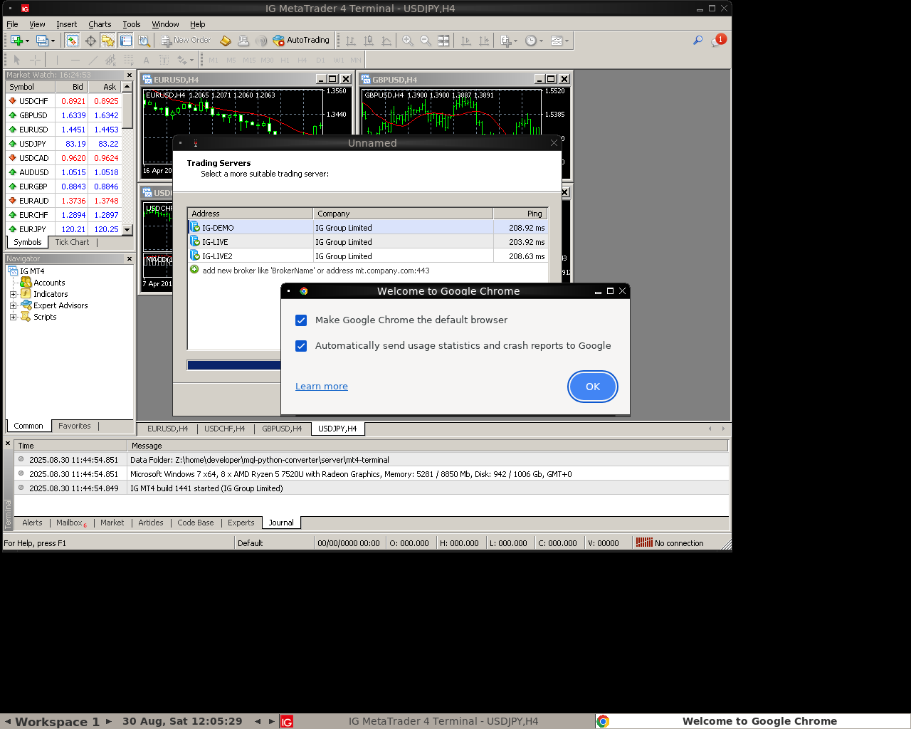

# MQL-Python Converter Documentation

## Overview
This directory contains comprehensive documentation for setting up and using GUI access tools, browsers, and the MT4 backtesting framework with Python integration.

## Documentation Structure

### 📚 Core Documentation

1. **[NoVNC Setup Guide](NOVNC_SETUP.md)**
   - Complete NoVNC installation and configuration
   - WebSocket proxy setup
   - SSL/TLS security configuration
   - Multi-user access setup
   - Performance optimization

2. **[Browser Setup Guide](BROWSER_SETUP.md)**
   - GUI browser installation (Chrome, Firefox, Chromium)
   - Text-based browsers (Lynx, W3M, Links2)
   - Headless browser configuration
   - Browser automation with Selenium/Puppeteer
   - Docker integration

3. **[GUI Access Guide](GUI_ACCESS_GUIDE.md)**
   - Complete GUI access setup and troubleshooting
   - Architecture overview
   - Multiple setup methods (Docker, Systemd, Scripts)
   - MT4 specific configurations
   - Performance monitoring

## Quick Start

### 🚀 Fastest Setup (Copy & Paste)

```bash
# Install everything needed for GUI access
sudo apt update && sudo apt install -y \
    xvfb x11vnc fluxbox \
    google-chrome-stable \
    lynx w3m \
    git python3

# Clone NoVNC
git clone https://github.com/novnc/noVNC.git ~/noVNC
git clone https://github.com/novnc/websockify ~/noVNC/utils/websockify

# Start GUI services
Xvfb :99 -screen 0 1280x1024x24 &
export DISPLAY=:99
fluxbox &
x11vnc -display :99 -rfbport 5999 -passwd mt4vnc -forever -shared &
cd ~/noVNC && ./utils/novnc_proxy --vnc localhost:5999 --listen 8080 &

# Access via browser
echo "Open http://localhost:8080/vnc.html in your browser"
echo "Password: mt4vnc"
```

## Available Services

### Current Setup Status

| Service | Port | Status | Access URL |
|---------|------|--------|------------|
| **NoVNC Web** | 8080 | ✅ Running | http://localhost:8080/vnc.html |
| **VNC Server** | 5999 | ✅ Running | vnc://localhost:5999 |
| **Virtual Display** | :99 | ✅ Running | DISPLAY=:99 |
| **MT4 Terminal** | - | ✅ Running | Via NoVNC/VNC |

### Installed Browsers

| Browser | Type | Command | Status |
|---------|------|---------|--------|
| **Google Chrome** | GUI | `google-chrome` | ✅ Installed |
| **Firefox** | GUI | `firefox` | ✅ Installed |
| **Chromium** | GUI | `chromium-browser` | ✅ Installed |
| **Lynx** | Text | `lynx` | ✅ Installed |
| **W3M** | Text | `w3m` | ✅ Installed |
| **Links2** | Text/GUI | `links2` | ✅ Installed |

## Screenshots

### MT4 Terminal with Charts


### GUI with Chrome Browser


## Common Tasks

### View Current GUI
```bash
# Take screenshot
DISPLAY=:99 import -window root /tmp/screenshot.png

# Open in browser
DISPLAY=:99 google-chrome http://localhost:8080
```

### Run Applications
```bash
# Run MT4
DISPLAY=:99 wine ~/mt4/terminal.exe

# Run Chrome
DISPLAY=:99 google-chrome --no-sandbox

# Run Firefox
DISPLAY=:99 firefox
```

### Control Services
```bash
# Check status
ps aux | grep -E "(Xvfb|vnc|novnc)"

# Restart VNC
killall x11vnc
DISPLAY=:99 x11vnc -display :99 -rfbport 5999 -passwd mt4vnc -forever -shared &

# Restart NoVNC
killall -9 websockify
cd ~/noVNC && ./utils/novnc_proxy --vnc localhost:5999 --listen 8080 &
```

## Troubleshooting Quick Fixes

### Black Screen
```bash
killall Xvfb fluxbox
Xvfb :99 -screen 0 1280x1024x24 &
DISPLAY=:99 fluxbox &
```

### Connection Refused
```bash
# Check ports
netstat -tlnp | grep -E "(5999|8080)"

# Restart all
~/gui-control.sh restart
```

### Slow Performance
```bash
# Use lower resolution
Xvfb :99 -screen 0 1024x768x16 &

# Optimize VNC
x11vnc -display :99 -rfbport 5999 -noxdamage -nowf
```

## Advanced Features

### SSL/TLS Setup
See [NoVNC Setup Guide](NOVNC_SETUP.md#ssltls-configuration) for secure HTTPS access.

### Multiple Displays
See [GUI Access Guide](GUI_ACCESS_GUIDE.md#multiple-displays) for running multiple virtual displays.

### Browser Automation
See [Browser Setup Guide](BROWSER_SETUP.md#browser-automation) for Selenium/Puppeteer examples.

### Docker Integration
All guides include Docker-specific configurations and Dockerfile examples.

## Support Matrix

| Feature | Linux | Docker | WSL2 | VM |
|---------|-------|--------|------|-----|
| Xvfb | ✅ | ✅ | ✅ | ✅ |
| NoVNC | ✅ | ✅ | ✅ | ✅ |
| Chrome | ✅ | ✅* | ✅ | ✅ |
| Firefox | ✅ | ✅ | ✅ | ✅ |
| MT4/Wine | ✅ | ⚠️ | ⚠️ | ✅ |

*Requires `--no-sandbox` flag in Docker

## Performance Guidelines

| Resolution | Color Depth | Use Case | Resource Usage |
|------------|------------|----------|----------------|
| 800x600 | 16-bit | Low bandwidth | Low |
| 1024x768 | 16-bit | Standard | Medium |
| 1280x1024 | 24-bit | Development | Medium-High |
| 1920x1080 | 24-bit | Full HD | High |

## Security Checklist

- [ ] VNC password set (not using default)
- [ ] NoVNC using HTTPS in production
- [ ] Firewall rules configured
- [ ] SSH tunneling for remote access
- [ ] Regular security updates
- [ ] Limited user permissions
- [ ] Session recording if required

## Additional Resources

### External Links
- [NoVNC Official Documentation](https://github.com/novnc/noVNC/wiki)
- [x11vnc Documentation](http://www.karlrunge.com/x11vnc/)
- [Chrome DevTools Protocol](https://chromedevtools.github.io/devtools-protocol/)
- [Wine Application Database](https://appdb.winehq.org/)

### Related Projects
- [Selenium Grid](https://www.selenium.dev/documentation/grid/)
- [Puppeteer](https://pptr.dev/)
- [Playwright](https://playwright.dev/)
- [Docker Selenium](https://github.com/SeleniumHQ/docker-selenium)

## Contributing

To improve this documentation:
1. Test the commands in your environment
2. Document any issues or improvements
3. Submit a pull request with your changes

## License

This documentation is part of the MQL-Python Converter project and follows the same license terms.